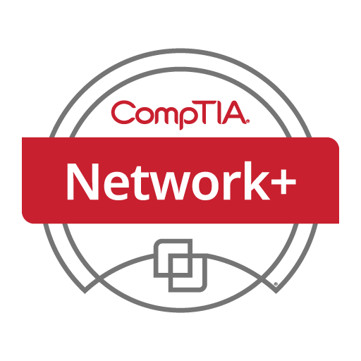

  

<h1 align="center">🚀 About Me</h1>

I like Computers, Maths, and the puzzles we can solve with them in the fields of Software Engineering and Cyber Security.

Currently employed as a Information Security Subject Matter Expert - Specifically focused on InfoSec Policies, Client Contracts, Security Assessments & Audits.

<h1 align="center"> Technical Skills</h1>

<!-- Certifications -->
<h2 align="center">🎓 My Certifications</h2>

<table>
  <tr>
    <!-- Icon Row -->
    <td align="center">
      
    </td>
    <td align="center">
      
    </td>
    <td align="center" width="25%">
        
      </td>
    <td align="center" width="25%">
        
      </td>
  </tr>
  <tr>
    <!-- Text Row -->
    <td align="center">
      🗓️ December 2022  
      🔗 <a href="https://www.bcs.org/qualifications-and-certifications/certifications-for-professionals/information-security-and-data-protection-certifications/bcs-foundation-certificate-in-information-security-management-principles/">Credential</a> 
      <em>Covers Information Security Management Principles.</em>
    </td>
    <td align="center">
      🗓️ April 2023  
      🔗 <a href="https://www.credly.com/badges/28606ef1-fa0c-432f-843c-ccb5e46a24fc">Credential</a> 
      <em>Covers Azure services, governance, and pricing models.</em>
    </td>
    <td align="center" width="25%">
        🗓️ May 2025 
        🔗 <a href="https://www.credly.com/badges/bb8ffc4a-eca8-4c24-85a3-eaf0773b22bb">Azure AI Fundamentals (AI‑900)</a> 
        <em>Azure AI workloads, services, and responsible AI.</em>
      </td>
    <td align="center">
      🗓️ August 2025  
      🔗 <a href="https://www.credly.com/badges/28606ef1-fa0c-432f-843c-ccb5e46a24fc">Credential</a> 
      <em>Microsoft Power Platform Fundamentals</em>
    </td>
  </tr>
  <tr>
    <!-- Icon Row -->
    <td align="center">
      
    </td>
    <td align="center">
      
    </td>
  </tr>
  <tr>
    <!-- Text Row -->
    <td align="center">
      🗓️ September 2025  
      🔗 <a href="https://www.bcs.org/qualifications-and-certifications/certifications-for-professionals/information-security-and-data-protection-certifications/bcs-foundation-certificate-in-information-security-management-principles/">Credential</a> 
      <em>Covers Information Security Management Principles.</em>
    </td>
    <td align="center">
      🗓️ September 2025  
      🔗 <a href="https://www.credly.com/badges/28606ef1-fa0c-432f-843c-ccb5e46a24fc">Credential</a> 
      <em>Covers Azure services, governance, and pricing models.</em>
    </td>
  </tr>
</table>

<h2 align="center">🏆 Featured Projects</h2>

<table>
  <tr>
    <td align="center" width="300" height="300">
      
       
      <a href="https://github.com/Hashim-ali02/MazeSolver"><strong>Maze Solver</strong>
       
      Maze Solver Python Tool
    </td>
    <td align="center" width="300" height="300">
      
       
      <a href="https://github.com/Hashim-ali02/static-site-generator"><strong>Static Site Generator</strong>
       
      Generates static site out of raw content files.
    </td>
    <td align="center" width="300" height="300">
      
       
      <a href="https://github.com/Hashim-ali02/asteroids"><strong>Asteroids</strong>
       
      2D Mini-Game
    </td>
    <td align="center" width="300" height="300">
      
       
      <a href="https://github.com/Hashim-ali02/bookbot"><strong>BookBot</strong>
       
      Simple Text Analysis Tool
    </td>
  </tr>
  <tr>
    <td align="center" width="100" height="100">
      <a href="https://github.com/Hashim-ali02/codecrafters-http-server-python">
       
      <strong>HTTP Server</strong>
       
      CodeCrafters.io build your own HTTP Server challenge.
    </td>
    <td align="center" width="100" height="100">
      <a href="https://github.com/Hashim-ali02/codecrafters-DNS-server-python">
       
      <strong>DNS Server</strong>
       
      CodeCrafters.io build your own DNS Server challenge.
    </td>
    <td align="center" width="100" height="100">
      <a href="https://github.com/Hashim-ali02/codecrafters-grep-python">
       
      <strong>Grep</strong>
       
      CodeCrafters.io build your own Grep challenge.
    </td>
    <td align="center" width="100" height="100">
      <a href="https://github.com/Hashim-ali02/codecrafters-shell-python">
       
      <strong>Shell</strong>
       
      CodeCrafters.io build your own Shell challenge.
    </td>
  </tr>

        
  <tr>
    <td align="center" width="300" height="300">
      <a href="https://github.com/Hashim-ali02/codecrafters-interpreter-python">
       
      <strong>Interpreter</strong>
       
      CodeCrafters.io build your own Interpreter challenge.
    </td>
    <td align="center" width="300" height="300">
      <a href="https://github.com/Hashim-ali02/codecrafters-redis-python">
       
      <strong>Redis</strong>
       
      CodeCrafters.io build your own Redis challenge.
    </td>
    <td align="center" width="300" height="300">
      <a href="https://github.com/Hashim-ali02/codecrafters-bittorrent-python">
       
      <strong>BitTorrent</strong>
       
      CodeCrafters.io build your own BitTorrent challenge.
    </td>
    <td align="center" width="300" height="300">
      <a href="https://github.com/Hashim-ali02/codecrafters-kafka-python">
       
      <strong>Kafka</strong>
       
      CodeCrafters.io build your own Kafka challenge.
    </td>
    <td align="center" width="300" height="300">
      <a href="https://github.com/Hashim-ali02/codecrafters-git-python">
       
      <strong>Git</strong>
       
      CodeCrafters.io build your own Git challenge.
    </td>
    <td align="center" width="300" height="300">
      <a href="https://github.com/Hashim-ali02/codecrafters-sqlite-python">
       
      <strong>SQLite</strong>
       
      CodeCrafters.io build your own SQLite challenge.
    </td>
  </tr>
</table>

 

<h2 align="center">Git Stats</h2>

  
  

   
   
 

<table>
  <tr>
    <td>
      
    </td>
    <td>
      
    </td>
    <td>
      
    </td>
  </tr>
</table>

### Top Repositories

  <table>
    <tr>
      <td>
        
      </td>
      <td>
        
      </td>
    </tr>
    <tr>
      <td>
        
      </td>
    </tr>
  </table>

### GitHub Contribution Chart

  

    &nbsp;&nbsp;Git Stats Summary&nbsp;&nbsp;
  

  
  
      
      

 

  
🆠GitHub Profile Trophy

   
    
  

 

<h3 align="center">Boot.dev Stats</h3>

  <a href="https://www.boot.dev/u/hashima02">

<h3 align="center">Leetcode Stats</h3>

  <a href="https://leetcode.com/u/hashim-ali02/">

<h3 align="center">Roadmap.sh Stats</h3>

  <a href="https://roadmap.sh">

 

<h2 align="center">📫 Let's Connect!</h2>

  

<h3>

  
⭐️ Let's work together! 

</h3>

